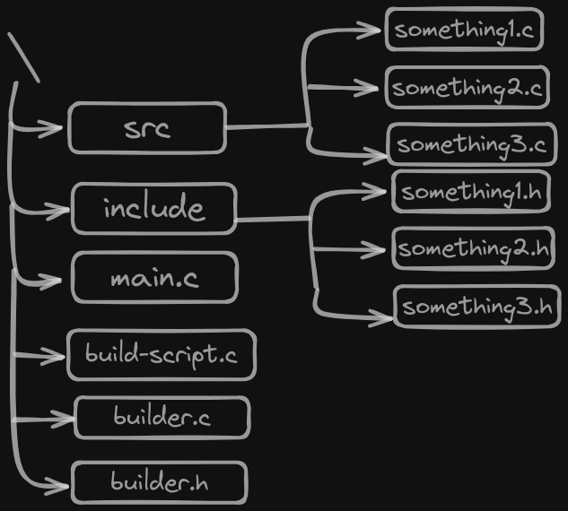

 


# Builder

Builder is a library written in C that simplifies the process of building your project. It provides an intuitive and flexible way to manage your project's files, compilers, flags, and build process.


## Usage


To use it just compile the builder.c with your build script in C.

```bash
  gcc builder.c [build-script.c] -o build
  ./build
```
    
## 

Refer to the provided code documentation and examples to gain a deeper understanding of the Builder structure and its usage.


## Example


Project tree is like this :




```c
#include <stdio.h>
#include "../builder.h"


bool is_suffix_with(char *strToCheck, char *suffix)
{
    size_t suffixLen = strlen(suffix);

    size_t strToCheckLen = strlen(strToCheck);

    if (strToCheckLen <= suffixLen)
        return false;

    return strcmp(strToCheck + (strToCheckLen - suffixLen), suffix) == 0;
}

bool filter_c_file(char *file)
{
    return is_suffix_with(file, ".c");
}


int main(){
    Builder *builder = builder_create();

    if (builder == NULL)
    {
        printf("cannot create the builder\n");
        return 1;
    }

    // [Provide the compiler you want to use]
    builder_add_compiler(builder, "gcc");

    //[Provide the compiler flag for compiling your project]
    builder_add_compiler_flag(builder, "-c");

    // Find all the files in directory ./src/
    FilePaths *files = find_files_with_filter("./src/", filter_c_file);
     if (files == NULL)
        return 1;

    // Include all the searched file as the file of project for compilation
    builder_add_file_path(builder, files);

    // Can add file manually
    builder_add_file(builder, "main.c");

    
    builder_build(builder);

    return 0;
}
```


## Features

- Give abstract for building project
- Break the project for compiling with its own config
- [TODO] Optimize project building without rebuilding everything (Cache system)


## Support

For support and further inquiries, please contact  underthehood913@gmail.com. Feel free to check the README file on the GitHub project repository for updates and additional information.

We appreciate your interest in Builder and hope it simplifies your project building process. If you encounter any issues or have suggestions for improvement, please don't hesitate to reach out. Happy coding! 

